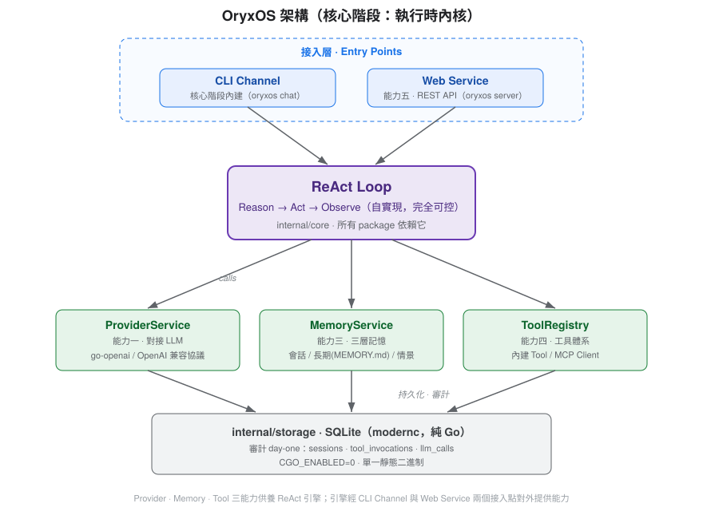

<p align="center">
  
</p>

<h1 align="center">OryxOS</h1>

<p align="center">
  用 Go 打造的企業級 <strong>Agent OS</strong><br>
  一個完全可控、單一靜態二進制部署的 Agent 運行時內核
</p>

<p align="center">
  
  = 1.24">
  
  <a href="./LICENSE"></a>
</p>

> [!WARNING]
> **專案現況：pre-alpha，Go module 骨架已落地。**
> Go 工程骨架（`go.mod`、`cmd/oryxos`、8 個 `internal/` package、`Makefile`）已就位，目前可用 `make test` 與 `make build`；核心功能依 spec（issue #1）的 tickets 逐張實作中。本 README 中的目錄結構、指令與功能仍有部分屬**目標狀態**，會隨 tickets 推進逐步落地。

---

## 這是什麼

OryxOS 是一個**企業級 Agent 作業系統**。它的定位不是又一個 Agent 框架，而是把「讓單個 Agent 跑得好」所需的運行時內核，做成一個可自我掌控、易於部署的底座：

- **基礎設施的母語是 Go。** CNCF 版圖（Kubernetes、Docker、Prometheus、etcd…）幾乎都用 Go 寫成；Agent OS 作為新一代基礎設施，用母語打底最自然。
- **完全可控，不靠框架魔法。** ReAct loop 自實現、Provider 與 Tool 一律顯式註冊，不採用任何框架的自動裝配或反射掃描。
- **Day-one 單一二進制。** `CGO_ENABLED=0` 靜態編譯成單一執行檔，直接執行，無需額外運行時。

> 核心階段先交付**執行時內核（五大核心能力）**；企業級治理層（多租戶、SSO、完整審計、Tool Policy）放到擴展階段。

---

## ✨ 五大核心能力

| # | 能力 | 說明 |
|---|------|------|
| 一 | **對接 LLM** | 以 `go-openai` 薄包裝接 OpenAI 兼容協議，配上自實現的 Provider 抽象；跨 provider 統一介面。 |
| 二 | **ReAct 循環** | Agent 的大腦。ReAct loop 由 `ReActLoop` ＋ `ToolExecutor` 完全自實現、可控，不採用框架的自動執行 Agent 抽象。 |
| 三 | **三層記憶（Memory）** | Session／長期記憶／情景記憶三層，統一門面對外；核心階段實作前兩層（SQLite ＋ `MEMORY.md`），情景記憶放擴展階段。 |
| 四 | **工具體系（Tool）** | 內建 Tool（File／Shell／Http）＋ MCP Client ＋ Plugin 自定義工具，主推 `SKILL.md` 與 MCP 的零程式碼接入。 |
| 五 | **Web Service** | 以 `net/http`（搭配 `chi`）對外暴露 HTTP API，供業務系統集成。 |

> 另有一個基礎模組 **Channel**（訊息接入渠道，負責「訊息進來、回應出去」）：核心階段只內建 **CLI**，Slack／Telegram／Discord 等 IM Channel 放擴展階段。

---

## 🏗️ 架構

Agent 的執行核心是一個自實現的 ReAct loop，向下驅動三大服務，並經 CLI Channel 與 Web Service 兩個接入點對外提供能力：



- **package 之間以介面解耦**：擴展階段加新 Channel／新 Tool 只加新 package、不動 `core`。
- **審計 day-one**：`tool_invocations`、`llm_calls` 從一開始就落庫（SQLite），可審計的資料地基先立起來。

---

## 🧰 技術棧

| 面向 | 選型 | 理由 |
|------|------|------|
| 語言 | **Go >= 1.24** | 基礎設施母語；快啟動、低記憶體、原生併發 |
| 部署 | **`CGO_ENABLED=0` 單一靜態二進制** | `go build` 直出，單檔部署、無需額外運行時 |
| 併發 | **goroutine ＋ `context`** | 阻塞路徑一律走 `context`（取消、超時、追蹤） |
| 儲存 | **`modernc.org/sqlite`（純 Go）** | 避免 cgo，守住單一靜態二進制（不用 `mattn/go-sqlite3`） |
| Web | **`net/http` ＋ `chi`** | 標準庫優先，不引入重框架 |
| LLM | **`go-openai`** | 只做協議轉換與 tool schema 生成，調度由自實現的 loop 控制 |
| CLI | **`cobra`** | `cmd/oryxos` 單一 main，Go ~10ms 啟動無負擔 |

---

## 📦 專案結構（目標狀態）

由 **8 個 `internal` package ＋ `cmd/oryxos`** 組成的單一 Go module：

```
oryxos/
├── cmd/oryxos/            # main ＋ cobra 命令樹（11 個子命令）
├── internal/
│   ├── core/             # 核心引擎：ReActLoop、PromptBuilder、ToolExecutor、ContextLoader…（所有 package 依賴）
│   ├── provider/         # 能力一：ProviderService、OpenAI 兼容 adapter、provider 顯式註冊
│   ├── memory/           # 能力三：MemoryService（統一門面）、LongTermMemory、MemoryTools
│   ├── tool/             # 能力四：內建 Tool、MCP Client、ToolRegistry、SandboxChecker（三合一）
│   ├── web/              # 能力五：HTTP server（net/http ＋ chi）、handler、OpenAPI
│   ├── channel/cli/      # CLI Channel 實現
│   ├── storage/          # SQLite（modernc）儲存層：sessions、tool_invocations、llm_calls
│   └── config/           # ConfigLoader 配置與密鑰加載
├── docs/                  # 規劃文檔（← 目前的「原始碼」）
│   ├── adr/              # 架構決策紀錄
│   └── agents/           # AI agent 協作設定（issue tracker、triage labels）
├── .github/               # Issue／PR 範本
├── constitution.md        # 專案憲法（六條不可協商原則）
├── CONTEXT.md             # 領域術語表
├── CONTRIBUTING.md        # 貢獻指南
├── SECURITY.md            # 安全政策與漏洞回報流程
├── CODE_OF_CONDUCT.md     # 行為準則
├── CLAUDE.md              # AI 協作上下文入口
├── LICENSE                # MIT
└── README.md
```

---

## 🚀 快速開始（規劃中）

> 以下為 `cmd/oryxos` 落地後的預期用法，目前尚不可執行。

```bash
# 建置單一靜態二進制
CGO_ENABLED=0 go build -o oryxos ./cmd/oryxos

# 初始化工作區
./oryxos init

# 與 Agent 對話（單次 CLI 模式）
./oryxos chat

# 啟動 HTTP 服務
./oryxos server
```

核心階段有兩種運行模式：**CLI（`chat`）** 與 **HTTP Server（`server`）**。CLI 共 11 個子命令：`init`、`status`、`chat`、`server`、`profile list/create/show/delete`、`provider list`、`tool list`、`session list`。

---

## 🗺️ 路線圖

- **核心階段（進行中）** — 執行時內核：五大核心能力 ＋ CLI Channel ＋ SQLite 審計地基。每張 ticket 完成後有可演示 demo。
- **擴展階段** — IM Channel（Slack／Telegram／Discord）、向量檢索（chromem-go／sqlite-vec／pgvector）、更多 Provider adapter。
- **社區／企業治理階段** — 多租戶、Tool Policy、完整審計、SSO。

---

## 📚 文檔

| 文件 | 內容 |
|------|------|
| [`constitution.md`](./constitution.md) | 專案憲法：六條不可協商的核心開發原則（效力高於一切） |
| [`CONTEXT.md`](./CONTEXT.md) | 領域術語表：正式術語的單一事實來源 |
| [`docs/adr/`](./docs/adr/) | 架構決策紀錄：每個難逆轉決策的理由與取捨 |
| [`docs/IndustryResearch.md`](./docs/IndustryResearch.md) | 業界調研：為什麼是 Go |
| [`docs/DemandAnalysis.md`](./docs/DemandAnalysis.md) | 需求分析：五大核心能力與典型場景 |
| [`docs/TechnicalSolution.md`](./docs/TechnicalSolution.md) | 技術方案：架構決策與工程結構 |
| [`docs/AIProgrammingGuide.md`](./docs/AIProgrammingGuide.md) | AI 編程指南：開發流程與實作審查清單 |

---

## 🤝 參與貢獻

歡迎參與！專案目前處於 pre-alpha 實作初期，**最有價值的貢獻仍是對 `docs/` 規劃文檔的修正、質疑與架構討論**；核心功能 tickets 由專案方依 spec 逐張推進。

- **開始之前**：請先讀 [`CONTRIBUTING.md`](./CONTRIBUTING.md) 與 [`constitution.md`](./constitution.md)
- **回報 Bug／提功能建議**：使用 [Issue 範本](https://github.com/rexshen5913/oryxos/issues/new/choose)
- **提問與設計討論**：開 [Discussion](https://github.com/rexshen5913/oryxos/discussions)
- **回報安全漏洞**：**請勿開公開 Issue**，改依 [`SECURITY.md`](./SECURITY.md) 私下回報
- **行為準則**：參與本專案即表示你同意遵守 [`CODE_OF_CONDUCT.md`](./CODE_OF_CONDUCT.md)

### 開發約定摘要

- **測試先行（不可協商）**：遵循 Red-Green-Refactor；單元測試優先採用**表格驅動測試**，並優先寫使用真實依賴的整合測試——LLM 呼叫是唯一例外，測試中一律回放錄製回應。
- **明確性**：所有錯誤顯式處理並以 `fmt.Errorf("...: %w", err)` 包裝；不使用全域變數傳遞狀態（依賴顯式注入）。
- **簡單性（YAGNI）**：只實作明確要求的功能，簡單函式與資料結構優於複雜的介面與繼承。
- **Commit 規範**：遵循 [Conventional Commits](https://www.conventionalcommits.org/)，格式 `<type>(<scope>): <subject>`。

> 完整原則以 [`constitution.md`](./constitution.md) 為準。

---

## 📄 授權

本專案採用 [MIT License](./LICENSE) 授權。
